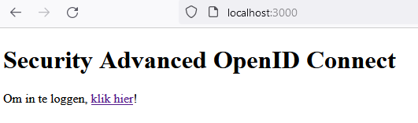
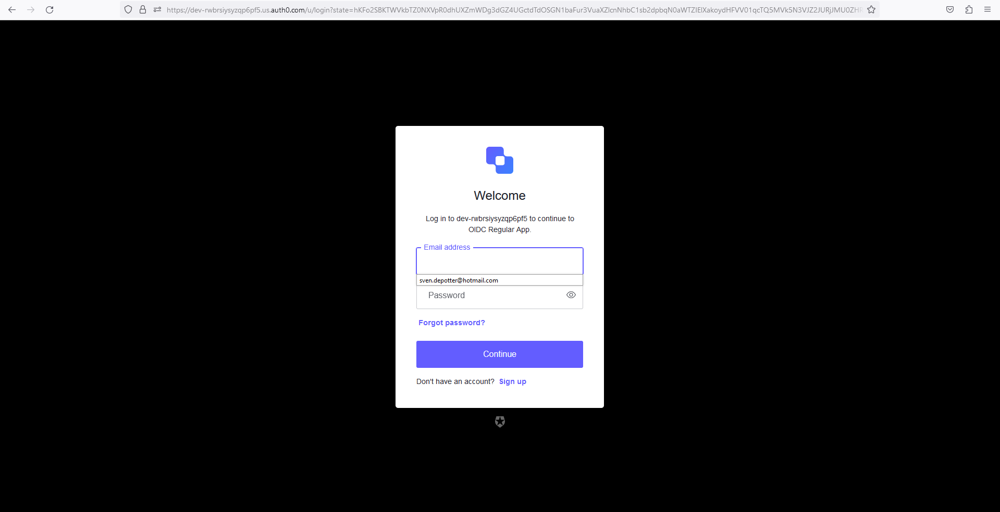
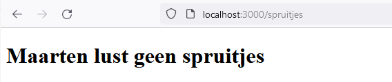
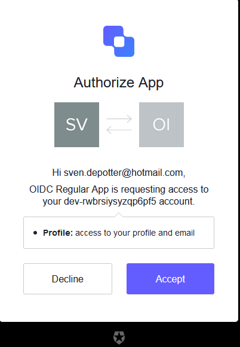

# Lab - Yellow Team
## Task 2 - OpenID Connect

De volledige code kan bekeken worden op `https://github.com/svendp1988/yellow-app`.

### server.js - eerste iteratie

Om OpenID Connect te implementeren heb ik tijdens een eerste iteratie volgende stappen uitgevoerd:
1. let oidcProviderInfo is een variabele die de nodige informatie zal bevatten omtrent mijn provider.
2. Voordat ik mijn app opstart, stuur ik een request naar discEnd:
```
const { OIDC_PROVIDER } = process.env;
const discEnd = `https://${OIDC_PROVIDER}/.well-known/openid-configuration`;
request(discEnd).then((res) => {
  oidcProviderInfo = JSON.parse(res);
  app.listen(PORT, () => {
    console.log(`Server running on ${PORT}`);
  });
}).catch((error) => {
  console.error(error);
  console.error('Unable to get OIDC endpoints for ${OIDC_PROVIDER}');
  process.exit(1);
});
```
Hierdoor zal mijn oidcProviderInfo variabele de nodige informatie bevatten om de OpenID Connect flow te kunnen uitvoeren.
3. het /login endpoint zal de gebruiker doorsturen naar de authorize endpoint van de provider, ik vraag een id_token en stel de scope in op openid,
De redirect_uri wordt ingesteld op http://localhost:3000/callback, dit is het endpoint waar de provider de gebruiker naartoe zal sturen na het inloggen.
Dit endpoint is ook zo geconfigureerd in mijn auth0 dashboard.

Mijn login methode ziet er als volgt uit:  
```
 app.get('/login', (req, res) => {

  // define constants for the authorization request
  const authorizationEndpoint = oidcProviderInfo['authorization_endpoint'];
  const responseType = 'id_token';
  const scope = 'openid';
  const clientID = process.env.CLIENT_ID;
  const redirectUri = 'http://localhost:3000/callback';
  const responseMode = 'form_post';
  const nonce = crypto.randomBytes(16).toString('hex');

  // define a signed cookie containing the nonce value
  const options = {
    maxAge: 1000 * 60 * 15,
    httpOnly: true, // The cookie only accessible by the web server
    signed: true // Indicates if the cookie should be signed
  };

  // add cookie to the response and set custom header to point front-end cell to auth URL
  res
    .cookie(nonceCookie, nonce, options)
    .redirect(
      authorizationEndpoint +
      '?response_mode=' + responseMode +
      '&response_type=' + responseType +
      '&scope=' + scope +
      '&client_id=' + clientID +
      '&redirect_uri=' + redirectUri +
      '&nonce=' + nonce
    );
});
```
4. Wanneer ik de app dus opstart, zal eerst de / route geladen worden, die ziet er als volgt uit:




5. Wanneer ik op de login knop klik, zal ik naar de authorize endpoint van mijn provider gestuurd worden, waar ik mijn credentials kan ingeven.



6. Mijn provider zal me na het inloggen doorsturen naar mijn callback endpoint, waar ik de id_token zal ontvangen. Ik zal deze token valideren en vervolgens de gebruiker doorsturen naar de /spruitjes route.

7. De /spruitjes route zal een .handlebars file renderen waarin de boodschap "Maarten lust geen spruitjes" zal getoond worden.



### server.js - tweede iteratie

Voor het implementeren van bovenstaande logica kan er ook gebruik gemaatk worden van passport, een SDK (Software Development Kit).
Passport is de populairste authentication middleware voor Node.js. Passport-auth0 is een plugin voor passport die het mogelijk maakt om OpenID Connect te implementeren.
Dit maakt het een stuk eenvoudiger te implementeren omdat er niet zoveel rekening gehouden moet worden met details.

1. Eerst heb ik Passport geconfigureerd om Auth0 te gebruiken. Dit doe ik door de volgende code toe te voegen aan mijn server.js file:
```
const passport = require('passport');
const Auth0Strategy = require('passport-auth0');

// Configure Passport to use Auth0
const auth0Strategy = new Auth0Strategy(
  {
    domain: process.env.OIDC_PROVIDER,
    clientID: process.env.CLIENT_ID,
    clientSecret: process.env.CLIENT_SECRET,
    callbackURL: 'http://localhost:3000/callback'
  },
  (accessToken, refreshToken, extraParams, profile, done) => {
    profile.idToken = extraParams.id_token;
    return done(null, profile);
  }
);
passport.use(auth0Strategy);
passport.serializeUser((user, done) => done(null, user));
passport.deserializeUser((user, done) => done(null, user));
app.use(passport.initialize());
app.use(passport.session());
```
2. Vervolgens heb ik de /login route aangepast zodat deze gebruik maakt van passport.authenticate:
```
app.get(
  '/login',
  passport.authenticate('auth0', {
    scope: 'openid email profile'
  })
);
```
3. De /callback route zal nu ook gebruik maken van passport.authenticate:
```
app.get('/callback', async (req, res, next) => {
  passport.authenticate('auth0', (err, user) => {
    if (err) return next(err);
    if (!user) return res.redirect('/login');

    req.logIn(user, function(err) {
      if (err) return next(err);
      res.redirect('/spruitjes');
    });
  })(req, res, next);
});
```
4. De /login route vraagt nu meer info op dan enkel openid, hierdoor zal de "login" pagina er iets anders uitzien.



5. De /spruitjes route blijft echter ongewijzigd en toont nog steeds de boodschap "Maarten lust geen spruitjes".

